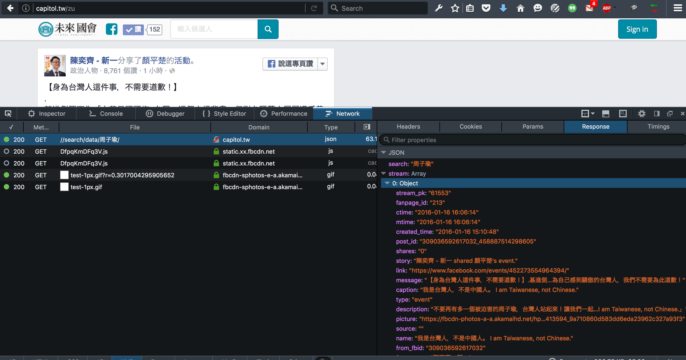
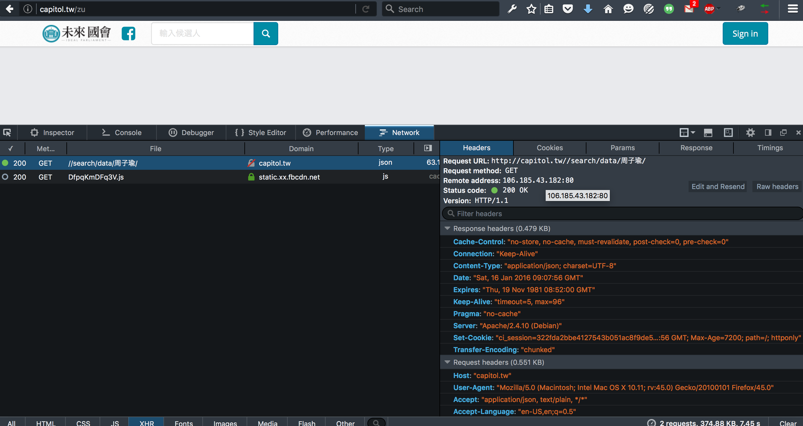
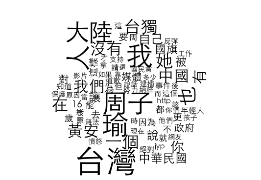

# 一開始在黑貘大大牆上看到有`API`可以用，但是沒有 idea...

---


# 直到選前一夜`激情`，突然全台灣都為了一個小女生瘋狂！

---


# 既然黑貘大大的`API`都做好了，何不來玩點小東西呢？

## 首先來看看資料在哪裡



## 接著找出資料的位置跟他的連線方法



# Let's play with R!

## 今天的材料

```{r}
library(jsonlite)
library(dplyr)
library(jiebaR)
library(wordcloud)
```

## 取得資料

```{r}
res <- jsonlite::fromJSON(URLencode(URL = "http://capitol.tw//search/data/周子瑜/"))
res$stream$message[1]
res$stream$message[length(res$stream)]
```

## 啟動`jiebaR`斷詞

```{r}
trySeg <- worker()
resSeg <- lapply(res$stream$message, function(x) trySeg[x])
class(resSeg)
length(resSeg)
head(resSeg, 1)
```

## 啟動`jiebaR`斷詞

```{r}
resSeg <- do.call("c", resSeg)
class(resSeg)
length(resSeg)
```

## 篩掉 stopping words，計算詞頻

```{r}
stopwords <- c("的", "是", "了", "跟", "與")
resSeg <- filter_segment(resSeg, stopwords)
resMtx <- table(resSeg)
tail(resMtx)
```

## 簡單清一下資料

```{r}
resMtx2 <- as.data.frame(resMtx) %>% filter(Freq > 2)
tail(resMtx2)
```

## 文字雲

```{r, eval=FALSE}
par(family='Heiti TC Light') # MAC only
wordcloud(resMtx2$resSeg2, resMtx2$Freq, min.freq = 5)
```

<div style="width:80%;">

</div>

# 候選人們在臉書上是怎麼po文聲援周子瑜的呢？

---

### 除了提到她的名字以外，最多人說「台灣」

- ### 台灣 ＞ 大陸 ＞ 中國 ＞ 中華民國

### 也很愛提到「我」

- ### 畢竟「我」才是候選人，才是主角啊！

### 也有人提到媒體

- ### 覺得都是媒體炒作

# 珍惜手中的選票，讓我們一起努力，讓臺灣成為一個更好的臺灣。