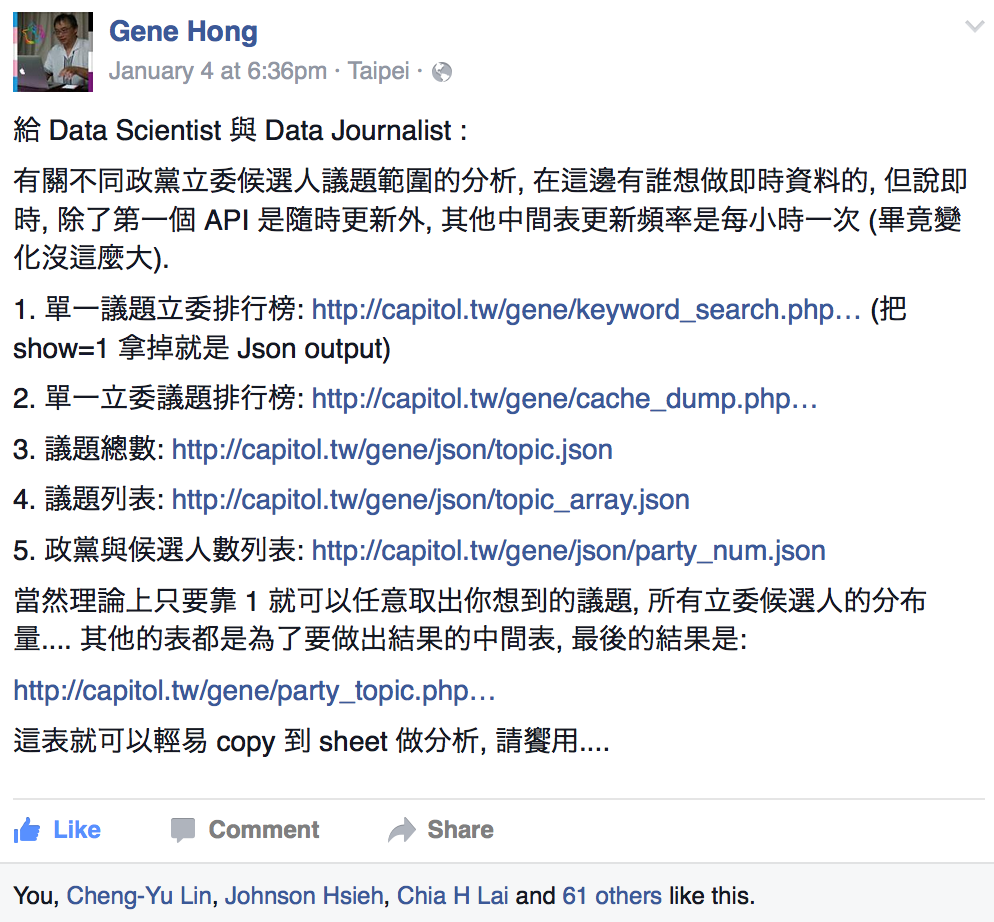
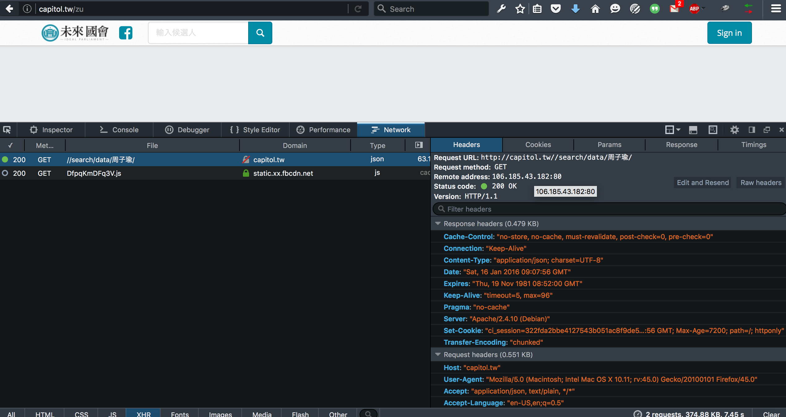

# 一開始在黑貘大大牆上看到有`API`可以用，但是沒有 idea...

---



# 直到選前一夜`激情`，突然全台灣都為了一個小女生瘋狂！

---


# 既然黑貘大大的`API`都做好了，何不來玩點小東西呢？

## 首先來看看資料在哪裡


## 接著找出資料的位置跟他的連線方法



# Let's play with R!

## 今天的材料


```r
library(jsonlite)
library(dplyr)
library(jiebaR)
library(wordcloud)
```

## 取得資料


```r
res <- jsonlite::fromJSON(URLencode(URL = "http://capitol.tw//search/data/周子瑜/"))
res$stream$message[1]
```

```
## [1] "--青天白日滿地紅--\n張安樂\n美麗的畫面\n『打倒列強、打倒列強，除軍閥、除軍閥，國民革命成功、國民革命成功，齊歡唱、齊歡唱。』\n忘了不知是哪部片子的銀幕裡，在『國民革命歌』的輕快歌聲伴隨下，一支雄赳赳、氣昂昂的隊伍，高舉著青天白日滿地紅的旗幟，邁向北伐的戰場。\n \n『中國一定強、中國一定強，你看那民族英雄謝團長。\n中國一定強、中國一定強，你看那八百壯士，孤軍奮守東戰場。\n四方都是炮火、四方都是豺狼，寧願死不退讓、寧願死不投降。\n我們的國旗在重圍中飄蕩、飄蕩、飄蕩、飄蕩！』\n『八百壯士』電影的銀幕裡，在『中國一定強』嘹亮的歌聲中，青天白日滿地紅的旗幟，在日軍的炮火下，驕傲地昇上了上海四行倉庫的頂樓。\n\n『山川壯麗，物產豐隆，炎黃世胄，東亞稱雄。毋自暴自棄，\n毋故步自封，光我民族，促進大同。創業維艱，緬懷諸先烈，\n守成不易，莫徒務近功。同心同德，貫徹始終，青天白日滿地紅。\n同心同德，貫徹始終，青天白日滿地紅。』 \n從小學到高中，每次升旗典禮上，青天白日滿地紅的旗幟，在『國旗歌』優雅的歌聲伴隨下，在旗桿上冉冉地上昇。\n\n光輝的歷史\n三個畫面代表了青天白日滿地紅這面旗幟的三個輝煌時代。\n    在『國民革命歌』時代，由國、共兩黨組成的國民革命軍，在青天白日滿地紅的旗幟底下，邁向北伐戰場，收服了盤踞在各地的軍閥，完成了國家初步的統一，展開了有『黃金十年』美譽的國家建設，奠定了日後抗戰的基礎。\n『八百壯士』時代，中華民族面臨了攸關生死存亡的日本侵華戰爭，當時全國人民包括國、共兩黨都團結在這面旗幟底下，奮起抵抗，經過八年的浴血奮鬥，終於打敗了日本，光復了臺灣，鴉片戰爭以來的百年恥辱也一掃而空，更就此一躍而為世界五強之一。\n後來雖然因為國民政府的失敗，這面旗幟被趕出了大陸，只能在台灣島上飄揚。但從此國民政府痛定思痛，在這面旗幟底下，勵精圖治，土地改革，發展經濟，推動民主，讓台灣從戰後滿目蒼夷、一窮二白的困境中走了出來，經濟上進入了中產階級社會，政治上也邁入了民主自由的體制，成為中國三民主義的模範省。\n不幸蒙塵 淪為台獨的工具\n曾幾何時，在李、扁等綠色政客的操弄下，那些在她呵護下，孕育成長的群眾，竟把她棄之如蔽履，甚或踐踏在腳下。2006年那場轟轟烈烈的倒扁運動，以藍營群眾為主的群眾，把她趕在外面，不准進場；綠營群眾則在他們的反制活動中，把她像垃圾一樣丟在地上，任人踐踏。\n沒想到一個小女孩周子瑜，突然把她捧成了時代的寵兒。許多經常踐踏她的綠色政客們，紛紛搶在各種媒體上露臉，說是要誓死捍衛她的尊嚴。但別高興的太早，他們並不是幡然悔悟，真心愛護這面旗幟，只是把她當作挑釁大陸，製造對立的工具罷了，用完後馬上就會把她丟到垃圾箱裡。\n兩岸統一 再現光芒\n難道這就是她的宿命嗎?不！絕對不是！只要兩岸統一，青天白日滿地紅就可以再現光芒。\n大陸以前不認她，因為她要與五星紅旗爭中國的正統；現在不認她，因為她已漸淪為台獨的護身符。但只要在一國兩制的框架下，兩岸和平統一後，青天白日滿地紅就可以：\n1、作為代表台灣地區的旗幟，大大方方的在台灣飄揚 ，屹立不倒。\n2、受到全中國人民的歡迎，堂而皇之地回到大陸，只要在有台商的地方，就可以在台商的園區，高高昇起。\n3、以代表中國台灣特區的身份，再次風風光光的進入國際舞台，在APEC、WHO、或者奧運的場合，迎風招展。\n兩岸早日統一吧！讓我們的青天白日滿地紅永遠飄揚，再現光芒！"
```

```r
res$stream$message[length(res$stream)]
```

```
## [1] "【健保應照顧弱勢，而非詆毀國家者】\n\n今日國是論壇，昭順特別以黃安回台「開心」事件為題發言。看到黃安的新聞，昭順心裡五味雜陳，黃安到大陸發展事業，然後又罵台灣是鬼地方，甚至連周子瑜拿國旗都要被其舉報！\n\n昭順認為，中華民國是主權獨立國家，而且我們對於國際醫療需求一向不遺餘力。但我們的國人到國外去詆毀我們的國家，又回來使用我們的健保，實是讓所有人民憤怒唾棄。\n\n昭順呼籲衛生福利部針對這樣的案例修法，讓健保能真正用在急需協助者，真正照顧需要的弱勢！"
```

## 啟動`jiebaR`斷詞


```r
trySeg <- worker()
resSeg <- lapply(res$stream$message, function(x) trySeg[x])
class(resSeg)
```

```
## [1] "list"
```

```r
length(resSeg)
```

```
## [1] 30
```

```r
head(resSeg, 1)
```

```
## [[1]]
##   [1] "青天白日"   "滿地"       "紅"         "張"         "安樂"      
##   [6] "美麗"       "的"         "畫面"       "打倒"       "列強"      
##  [11] "打倒"       "列強"       "除"         "軍閥"       "除"        
##  [16] "軍閥"       "國民革命"   "成功"       "國民革命"   "成功"      
##  [21] "齊"         "歡唱"       "齊"         "歡唱"       "忘"        
##  [26] "了"         "不知"       "是"         "哪部"       "片子"      
##  [31] "的"         "銀幕"       "裡"         "在"         "國民革命"  
##  [36] "歌"         "的"         "輕快"       "歌聲"       "伴隨"      
##  [41] "下"         "一支"       "雄赳赳"     "氣昂昂"     "的"        
##  [46] "隊伍"       "高舉"       "著"         "青天白日"   "滿地"      
##  [51] "紅的"       "旗幟"       "邁向"       "北伐"       "的"        
##  [56] "戰場"       "中國"       "一定"       "強"         "中國"      
##  [61] "一定"       "強"         "你"         "看"         "那"        
##  [66] "民族英雄"   "謝"         "團長"       "中國"       "一定"      
##  [71] "強"         "中國"       "一定"       "強"         "你"        
##  [76] "看"         "那"         "八百壯士"   "孤軍"       "奮守東"    
##  [81] "戰場"       "四方"       "都"         "是"         "炮火"      
##  [86] "四方"       "都"         "是"         "豺狼"       "寧願"      
##  [91] "死"         "不"         "退讓"       "寧願"       "死"        
##  [96] "不"         "投降"       "我們"       "的"         "國旗"      
## [101] "在"         "重圍"       "中"         "飄蕩"       "飄蕩"      
## [106] "飄蕩"       "飄蕩"       "八百壯士"   "電影"       "的"        
## [111] "銀幕"       "裡"         "在"         "中國"       "一定"      
## [116] "強"         "嘹亮"       "的"         "歌聲"       "中"        
## [121] "青天白日"   "滿地"       "紅的"       "旗幟"       "在"        
## [126] "日軍"       "的"         "炮火"       "下"         "驕傲地"    
## [131] "昇"         "上"         "了"         "上海"       "四行"      
## [136] "倉庫"       "的"         "頂樓"       "山川"       "壯麗"      
## [141] "物產"       "豐隆"       "炎黃"       "世胄"       "東亞"      
## [146] "稱雄"       "毋"         "自暴自棄"   "毋"         "故步自封"  
## [151] "光"         "我"         "民族"       "促進"       "大同"      
## [156] "創業維艱"   "緬懷"       "諸"         "先烈"       "守成不易"  
## [161] "莫徒務"     "近功"       "同心同德"   "貫徹始終"   "青天白日"  
## [166] "滿地"       "紅"         "同心同德"   "貫徹始終"   "青天白日"  
## [171] "滿地"       "紅"         "從小"       "學到"       "高中"      
## [176] "每次"       "升旗典禮"   "上"         "青天白日"   "滿地"      
## [181] "紅的"       "旗幟"       "在"         "國旗歌"     "優雅"      
## [186] "的"         "歌聲"       "伴隨"       "下"         "在"        
## [191] "旗桿"       "上"         "冉冉"       "地上"       "昇"        
## [196] "光輝"       "的"         "歷史"       "三個"       "畫面"      
## [201] "代表"       "了"         "青天白日"   "滿地"       "紅"        
## [206] "這面"       "旗幟"       "的"         "三個"       "輝煌"      
## [211] "時代"       "在"         "國民革命"   "歌"         "時代"      
## [216] "由國"       "共"         "兩"         "黨"         "組成"      
## [221] "的"         "國民革命軍" "在"         "青天白日"   "滿地"      
## [226] "紅的"       "旗幟"       "底下"       "邁向"       "北伐"      
## [231] "戰場"       "收服"       "了"         "盤踞"       "在"        
## [236] "各地"       "的"         "軍閥"       "完成"       "了"        
## [241] "國家"       "初步"       "的"         "統一"       "展開"      
## [246] "了有"       "黃金"       "十年"       "美譽"       "的"        
## [251] "國家"       "建設"       "奠定"       "了"         "日後"      
## [256] "抗戰"       "的"         "基礎"       "八百壯士"   "時代"      
## [261] "中華民族"   "面臨"       "了"         "攸關"       "生死存亡"  
## [266] "的"         "日本"       "侵華"       "戰爭"       "當時"      
## [271] "全國"       "人民"       "包括"       "國"         "共"        
## [276] "兩"         "黨"         "都"         "團結"       "在"        
## [281] "這面"       "旗幟"       "底下"       "奮起"       "抵抗"      
## [286] "經過"       "八年"       "的"         "浴血"       "奮鬥"      
## [291] "終於"       "打敗"       "了"         "日本"       "光復"      
## [296] "了"         "臺灣"       "鴉片戰爭"   "以來"       "的"        
## [301] "百年"       "恥辱"       "也"         "一掃而空"   "更"        
## [306] "就此"       "一躍而"     "為"         "世界"       "五強"      
## [311] "之一"       "後來"       "雖然"       "因為"       "國民政府"  
## [316] "的"         "失敗"       "這面"       "旗幟"       "被"        
## [321] "趕出"       "了"         "大陸"       "只能"       "在"        
## [326] "台灣"       "島上"       "飄揚"       "但"         "從此"      
## [331] "國民政府"   "痛定思痛"   "在"         "這面"       "旗幟"      
## [336] "底下"       "勵精圖治"   "土地改革"   "發展"       "經濟"      
## [341] "推動"       "民主"       "讓"         "台灣"       "從"        
## [346] "戰後"       "滿目"       "蒼夷"       "一窮二白"   "的"        
## [351] "困境"       "中"         "走"         "了"         "出來"      
## [356] "經濟"       "上"         "進入"       "了"         "中產階級"  
## [361] "社會"       "政治"       "上"         "也"         "邁入"      
## [366] "了"         "民主自由"   "的"         "體制"       "成為"      
## [371] "中國"       "三民主義"   "的"         "模範省"     "不幸"      
## [376] "蒙塵"       "淪為"       "台獨"       "的"         "工具"      
## [381] "曾幾何時"   "在李"       "扁"         "等"         "綠色"      
## [386] "政客"       "的"         "操弄"       "下"         "那些"      
## [391] "在"         "她"         "呵護"       "下"         "孕育"      
## [396] "成長"       "的"         "群眾"       "竟"         "把"        
## [401] "她棄"       "之"         "如蔽履"     "甚或"       "踐踏在"    
## [406] "腳下"       "2006"       "年"         "那場"       "轟轟烈烈"  
## [411] "的"         "倒"         "扁"         "運動"       "以藍營"    
## [416] "群眾"       "為"         "主"         "的"         "群眾"      
## [421] "把"         "她"         "趕"         "在"         "外面"      
## [426] "不准"       "進場"       "綠營"       "群眾則"     "在"        
## [431] "他們"       "的"         "反制"       "活動"       "中"        
## [436] "把"         "她"         "像"         "垃圾"       "一樣"      
## [441] "丟在"       "地上"       "任人"       "踐踏"       "沒想到"    
## [446] "一個"       "小女孩"     "周子"       "瑜"         "突然"      
## [451] "把"         "她"         "捧成"       "了"         "時代"      
## [456] "的"         "寵兒"       "許多"       "經常"       "踐踏"      
## [461] "她"         "的"         "綠色"       "政客"       "們"        
## [466] "紛紛"       "搶"         "在"         "各種"       "媒體"      
## [471] "上"         "露臉"       "說"         "是"         "要"        
## [476] "誓死捍衛"   "她"         "的"         "尊嚴"       "但別"      
## [481] "高興"       "的"         "太早"       "他們"       "並"        
## [486] "不是"       "幡然悔悟"   "真心"       "愛護"       "這面"      
## [491] "旗幟"       "只是"       "把"         "她"         "當作"      
## [496] "挑釁"       "大陸"       "製造"       "對立"       "的"        
## [501] "工具"       "罷了"       "用"         "完"         "後"        
## [506] "馬上"       "就"         "會"         "把"         "她"        
## [511] "丟到"       "垃圾箱"     "裡"         "兩岸"       "統一"      
## [516] "再現"       "光芒"       "難道"       "這"         "就是"      
## [521] "她"         "的"         "宿命"       "嗎"         "不"        
## [526] "絕對"       "不是"       "只要"       "兩岸"       "統一"      
## [531] "青天白日"   "滿地"       "紅就"       "可以"       "再現"      
## [536] "光芒"       "大陸"       "以前"       "不認"       "她"        
## [541] "因為"       "她"         "要"         "與"         "五星紅旗"  
## [546] "爭"         "中國"       "的"         "正統"       "現在"      
## [551] "不認"       "她"         "因為"       "她"         "已漸"      
## [556] "淪為"       "台獨"       "的"         "護身符"     "但"        
## [561] "只要"       "在"         "一國兩制"   "的"         "框架"      
## [566] "下"         "兩岸"       "和平統一"   "後"         "青天白日"  
## [571] "滿地"       "紅就"       "可以"       "1"          "作"        
## [576] "為"         "代表"       "台灣"       "地區"       "的"        
## [581] "旗幟"       "大大方方"   "的"         "在"         "台灣"      
## [586] "飄揚"       "屹立"       "不倒"       "2"          "受到"      
## [591] "全"         "中國"       "人民"       "的"         "歡迎"      
## [596] "堂而皇之"   "地"         "回到"       "大陸"       "只要"      
## [601] "在"         "有"         "台商"       "的"         "地方"      
## [606] "就"         "可以"       "在"         "台商"       "的"        
## [611] "園區"       "高高"       "昇"         "起"         "3"         
## [616] "以"         "代表"       "中國"       "台灣"       "特區"      
## [621] "的"         "身份"       "再次"       "風風光光"   "的"        
## [626] "進入"       "國際"       "舞台"       "在"         "APEC"      
## [631] "WHO"        "或者"       "奧運"       "的"         "場合"      
## [636] "迎風招展"   "兩岸"       "早日"       "統一"       "吧"        
## [641] "讓"         "我們"       "的"         "青天白日"   "滿地"      
## [646] "紅"         "永遠"       "飄揚"       "再現"       "光芒"
```

## 啟動`jiebaR`斷詞


```r
resSeg <- do.call("c", resSeg)
class(resSeg)
```

```
## [1] "character"
```

```r
length(resSeg)
```

```
## [1] 5647
```

## 篩掉 stopping words，計算詞頻


```r
stopwords <- c("的", "是", "了", "跟", "與", "在")
resSeg <- filter_segment(resSeg, stopwords)
resMtx <- table(resSeg)
tail(resMtx)
```

```
## resSeg
##     黨內     黨名     黨產   黨產偷       齊 龍兄虎弟 
##        1        1        1        1        2        1
```

## 簡單清一下資料


```r
resMtx2 <- as.data.frame(resMtx) %>% filter(Freq > 2)
tail(resMtx2)
```

```
##     resSeg Freq
## 421 馬英九   10
## 422   高興    5
## 423   高舉    4
## 424     黃    3
## 425   黃安   62
## 426     黨   17
```

## 文字雲


```r
par(family='Heiti TC Light') # MAC only
pal <- brewer.pal(9,"Paired")
wordcloud(resMtx2$resSeg, resMtx2$Freq, min.freq = 5, colors=pal)
```


<div style="width:80%;">

</div>

# 候選人們在臉書上是怎麼po文聲援周子瑜的呢？

---

### 除了提到她的名字以外，最多人說「台灣」

- ### 台灣 ＞ 大陸 ＞ 中國 ＞ 中華民國

### 也很愛提到「我」

- ### 畢竟「我」才是候選人，才是主角啊！

### 也有人提到媒體

- ### 覺得都是媒體炒作

# 珍惜手中的選票，讓我們一起努力，讓臺灣成為一個更好的臺灣。
